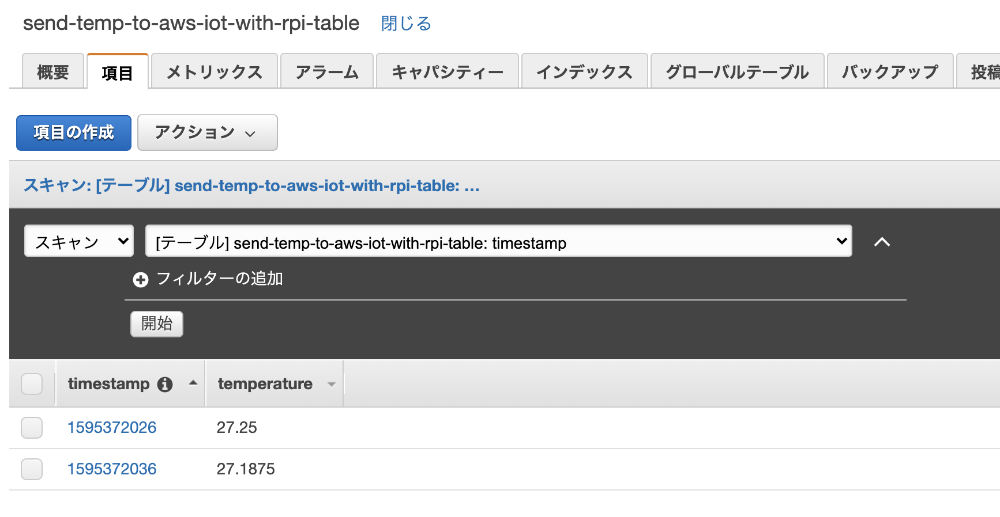

# send-temp-to-aws-iot-with-rpi

Rust を使って Raspberry Pi から温度センサーの値を読み取り、AWS Iot Core に Publish した後、送信したデータが DynamoDB に格納される流れを確認します。

尚、AWS IoT Core や DynamoDB のテーブルなどのデプロイは、Raspberry Pi からではなく、macOS にて実施することを想定しています。（Raspberry Pi 上で cdk を叩けるようにするまでの手順等は、ここには記載しません）

## デプロイ実施環境

```
$ sw_vers
ProductName:	Mac OS X
ProductVersion:	10.14.6
BuildVersion:	18G103

$ aws --version
aws-cli/1.16.156 Python/3.7.6 Darwin/18.7.0 botocore/1.13.44

$ cdk --version
1.49.1 (build 7d6321f)

$ yarn --version
1.19.1
```

## デプロイ手順

### 1. AWS マネジメントコンソール にて 1-Click 証明書を作成 & 有効化する

証明書を作成した後は、`モノの証明書`・`プライベートキー`・`AWS IoT のルート CA` をダウンロードしてください。証明書の有効化もお忘れなく。

### 2. 環境変数を設定する

環境変数 `AWS_IOT_CERTIFICATE_ARN` に、作成した証明書の ARN を入れてください。この環境変数はデプロイ時に使用します。

### 3. Backend をデプロイする

下記の手順に従って、デプロイしてください。

```
$ cd backend/

$ yarn install
$ yarn build

$ cdk bootstrap
$ cdk deploy
```

## デバイス（Raspberry Pi） 側で データを Publish する

環境やプログラムの詳細などは公開している[こちらの記事](https://dev.classmethod.jp/articles/rust-rpi-publish-temp-to-aws-iot/)をご参照ください。こちらの手順は Rapsberry Pi 側で実施します。

### 1. 証明書等々の移動 & リネーム

デプロイ手順1 でダウンロードしたファイルを `src/` 内に移動してください。

また、それぞれのファイルを以下の名前に変更してください。
* モノの証明書：`certificate.pem.crt`
* プライベートキー：`private.pem.key`
* AWS IoT のルート CA：`AmazonRootCA1.pem`

### 2. 環境変数を設定する

環境変数 `AWS_IOT_CLIENT_ID` にデプロイしたモノの名前を入れてください。おそらく `send-temp-to-aws-iot-with-rpi-thing` になっていると思います。

次に、環境変数 `AWS_IOT_ENDPOINT` に AWS IoT に接続するためのカスタムエンドポイントを入れてください。

### 3. プログラムの実行

下記の手順に従って、プログラムを実行してください。

```
$ cd src/

$ cargo run main.rs
    Finished dev [unoptimized + debuginfo] target(s) in 1.03s
     Running `<PATH>/send-temp-to-aws-iot-with-rpi/target/debug/send-temp-to-aws-iot-with-rpi`
Publish(Publish { dup: false, qos: AtLeastOnce, retain: false, topic_name: "iot/topic", pkid: Some(PacketIdentifier(1)), payload: [123, 34, 116, 105, 109, 101, 115, 116, 97, 109, 112, 34, 58, 49, 53, 57, 53, 51, 52, 51, 51, 53, 53, 44, 34, 116, 101, 109, 112, 101, 114, 97, 116, 117, 114, 101, 34, 58, 50, 55, 46, 48, 125] })
Publish(Publish { dup: false, qos: AtLeastOnce, retain: false, topic_name: "iot/topic", pkid: Some(PacketIdentifier(1)), payload: [123, 34, 116, 105, 109, 101, 115, 116, 97, 109, 112, 34, 58, 49, 53, 57, 53, 51, 52, 51, 51, 54, 53, 44, 34, 116, 101, 109, 112, 101, 114, 97, 116, 117, 114, 101, 34, 58, 50, 55, 46, 48, 125] })
Publish(Publish { dup: false, qos: AtLeastOnce, retain: false, topic_name: "iot/topic", pkid: Some(PacketIdentifier(1)), payload: [123, 34, 116, 105, 109, 101, 115, 116, 97, 109, 112, 34, 58, 49, 53, 57, 53, 51, 52, 51, 51, 55, 53, 44, 34, 116, 101, 109, 112, 101, 114, 97, 116, 117, 114, 101, 34, 58, 50, 55, 46, 48, 125] })
```

## 結果を確認する

AWS マネジメントコンソール にて DynamoDB のページに移動した後、`send-temp-to-aws-iot-with-rpi-table` テーブルの項目を確認してください。下記のように、Publish したデータが格納されていることが確認できると思います。


